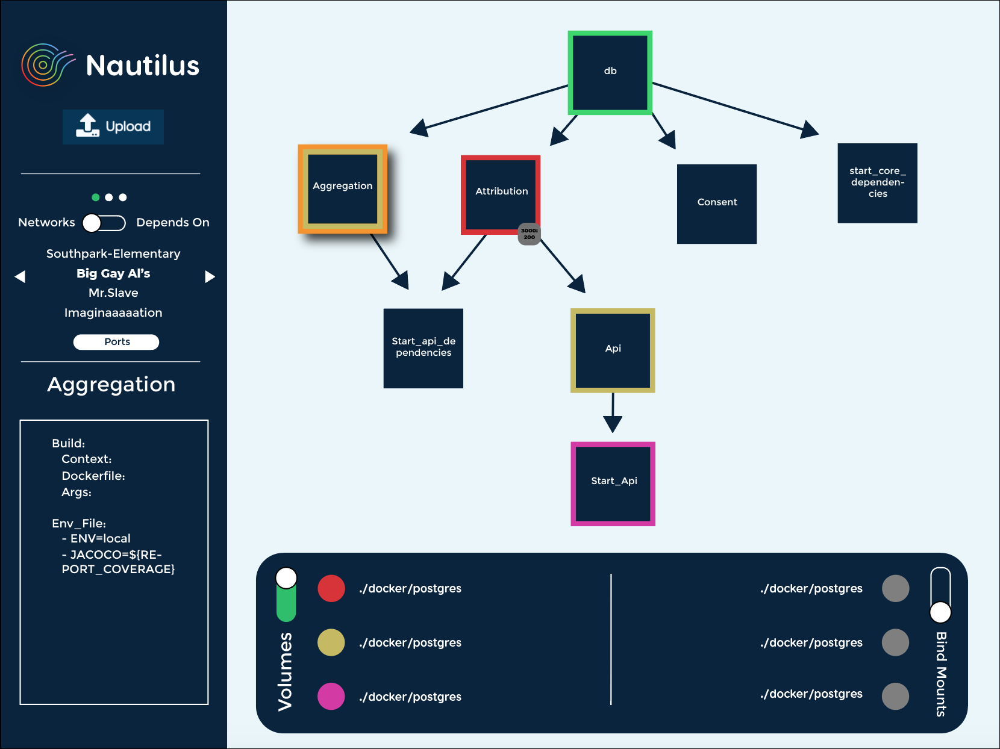

<h1 align="center">
  
</h1>

<p align="center">
  A <code>4kb</code> framework for creating sturdy frontend applications
</p>

<p align="center">
  <!-- License -->
  

  <!-- Release -->
  

  <!-- Release Date -->
  

  <!-- Test -->
  

  <!-- Typescript (Dominant Languge Used) -->
  

  <!-- Repo Size -->
  

  <!-- Contributions -->
  

  <!-- Test Coverage -->
  <a href="https://codecov.io/github/choojs/choo">
    
  </a>

  <!-- Stability -->
  

  <!-- Code Style -->
  
</p>

<p align="center">
  <sub> No nautili were harmed during the making of this application
  <br>
  - Aris, Danny, Josh, Michael, Tyler
</p>

<!-- TABLE OF CONTENTS -->

## Table of Contents

- [Features](#about-the-project)
  - [Networks View](#networks-view)
  - [Depends On View](#depends-on-view)
  - [Ports and Volumes Toggles](#ports-and-volumes-toggles)
  - [Service Info Display](#service-info-display)
- [Getting Started](#getting-started)
  - [Prerequisites](#prerequisites)
  - [Installation](#installation)
  - [Mac Download](#mac-download)
  - [Windows Download](#windows-download)
  - [Linux Download](#linux-download)
- [Exporting](#exporting)
- [Contributing/Feedback](#contributing)
- [Technologies Used](#technologies-used)
- [You May Also Like...](#you-may-also-like)
- [License](#license)

<!-- ABOUT THE PROJECT -->

## Features

### Networks View

<p align="center">
  
</p>

### Depends On View

<p align="center">
  
</p>

### Ports and Volumes Toggles

<p align="center">
  
</p>

### Service Info Display

<p align="center">
  
</p>

<!-- GETTING STARTED -->

## Getting Started

This is an example of how you may give instructions on setting up your project locally.
To get a local copy up and running follow these simple example steps.

### Prerequisites

This is an example of how to list things you need to use the software and how to install them.

- npm

```sh
npm install npm@latest -g
```

### Installation

1. Get a free API Key at [https://example.com](https://example.com)
2. Clone the repo

```sh
git clone https://github.com/your_username_/Project-Name.git
```

3. Install NPM packages

```sh
npm install
```

4. Enter your API in `config.js`

```JS
const API_KEY = 'ENTER YOUR API';
```

### Mac Download

### Windows Download

### Linux Download

<!-- EXPORTING -->

## Exporting

Use this space to show useful examples of how a project can be used. Additional screenshots, code examples and demos work well in this space. You may also link to more resources.

_For more examples, please refer to the [Documentation](https://example.com)_

<!-- CONTRIBUTING -->

## Contributing

Contributions are what make the open source community such an amazing place to be learn, inspire, and create. Any contributions you make are **greatly appreciated**.

1. Fork the Project
2. Install Dependencies
   <br>

```
yarn install
```

OR

```
npm i
```

3. Create your Feature Branch
   <br>

```
git checkout -b feature/AmazingFeature
```

4. Commit your Changes (`git commit -m 'Add some AmazingFeature'`)
5. Push to the Branch (`git push origin feature/AmazingFeature`)
6. Open a Pull Request

<!-- TECHNOLOGIES USED -->

## Technologies Used

This section should list any major frameworks that you built your project using. Leave any add-ons/plugins for the acknowledgements section. Here are a few examples.

- [TypeScript](https://www.typescriptlang.org/)
- [Electron](https://www.electronjs.org/)
- [D3](https://d3js.org/)
- [React with Hooks](https://reactjs.org/)
- [Jest](https://jestjs.io/)
- [Enzyme](https://github.com/enzymejs/enzyme)
- [Travis CI](https://travis-ci.org/)
- [SCSS](https://sass-lang.com/)
- [Webpack](https://webpack.js.org/)
- [Babel](https://babeljs.io/)

<!-- YOU MAY ALSO LIKE -->

## You May Also Like...

- [bankai](https://github.com/choojs/bankai) - streaming asset compiler
- [stack.gl](http://stack.gl/) - open software ecosystem for WebGL
- [yo-yo](https://github.com/maxogden/yo-yo) - tiny library for modular UI
- [tachyons](https://github.com/tachyons-css/tachyons) - functional CSS for
  humans
- [sheetify](https://github.com/stackcss/sheetify) - modular CSS bundler for
  `browserify`

  <!-- LICENSE -->

## License

Distributed under the MIT License. See `LICENSE` for more information.

Your Name - [@your_twitter](https://twitter.com/your_username)
